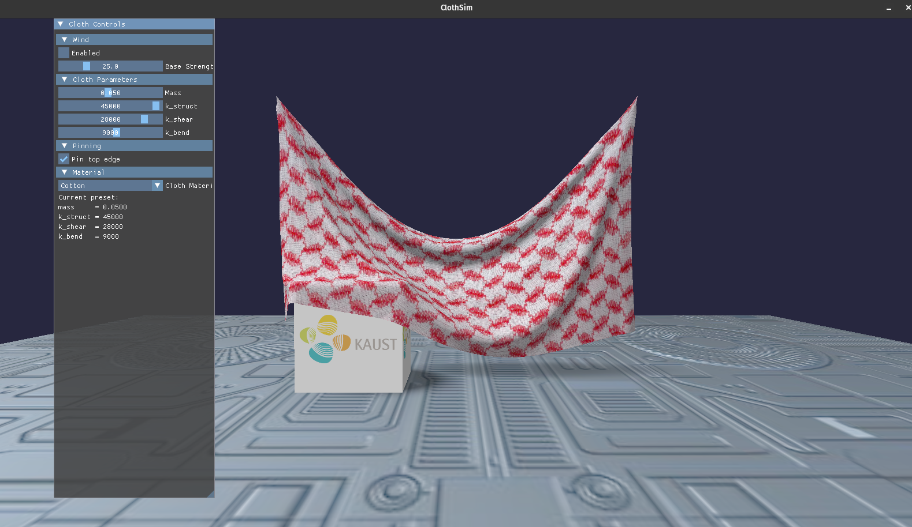
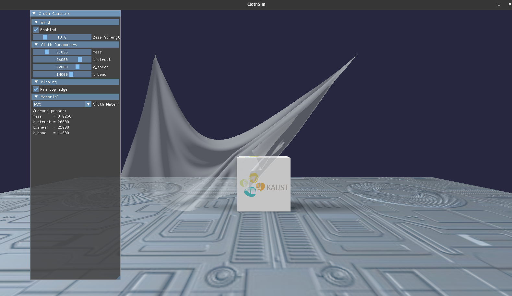

OVERVIEW
--------

This project implements an interactive real-time cloth simulation system using
CUDA for physics computation, Vulkan for real-time rendering, and Dear ImGui for
interactive parameter control.

The system demonstrates physically plausible cloth dynamics with user
interaction, multiple material presets, collision handling, and real-time
visualization.

FEATURES
--------

Cloth Physics
- Mass-spring cloth model on a regular 2D grid
- Structural, shear, and bend springs
- Gravity, damping, and wind forces
- Fixed time-step simulation with explicit (semi-implicit Euler) integration
- Optional pinning of the top edge

Collision Handling
- Infinite ground plane
- Movable axis-aligned box obstacle
- Simple geometric collision response

Interaction
- Mouse click applies a localized impulse to the cloth
- Keyboard-controlled box movement (W A S D)

Material Presets
- Cotton: relatively stiff, moderate bending
- Elastane: soft, stretchy, large deformations
- PVC: intermediate stiffness, shiny and semi-transparent

Rendering
- Vulkan-based rendering pipeline
- Lambertian diffuse shading
- Per-material textures and shading parameters
- Alpha blending for transparent PVC
- Fake soft shadow approximation

DEMO CONTROLS
-------------

Keyboard
W A S D  : Move the box obstacle

Mouse
Left Click : Apply impulse to the cloth

UI (ImGui)
- Toggle wind on or off
- Adjust wind strength
- Adjust mass and spring stiffness
- Toggle pinning of the top edge
- Switch material preset

PHYSICAL MODEL
--------------

The cloth is modeled as a classic mass-spring system.
Each particle has position x, velocity v, and mass m.

Spring force follows Hooke's law:

F = -k * (|d| - L0) * d / |d|

Additional forces:
- Gravity
- Velocity damping
- Directional, time-varying wind force

Time integration uses a fixed time step with a semi-implicit Euler scheme.

PROGRAM ARCHITECTURE
--------------------

Project Structure

.
├── app
│   └── main.cpp                     # Application entry point
├── assets
│   ├── shaders                      # Vulkan shaders
│   │   ├── cloth.vert
│   │   └── cloth.frag
│   └── textures                     # Cloth, ground, and logo textures
├── core
│   └── cloth
│       ├── cloth_builder.cpp        # Regular grid cloth construction
│       ├── cloth_builder.hpp
│       └── cloth_model.hpp
├── physics
│   └── cuda
│       ├── cuda_solver.cu           # CUDA-based cloth solver
│       ├── cuda_solver.hpp
│       └── cuda_buffers.hpp
├── render
│   └── vulkan
│       ├── vk_renderer.cpp          # Vulkan renderer implementation
│       └── vk_renderer.hpp
├── sim
│   ├── scene.hpp                    # Scene description
│   └── simulator.hpp                # Simulation control and stepping
├── ui
│   ├── ui_panel.cpp                 # ImGui panel implementation
│   ├── ui_panel.hpp
│   └── ui_state.hpp                 # UI-controlled parameters
├── third_party
│   └── imgui                        # ImGui library
└── CMakeLists.txt                   # CMake build configuration

Data Flow

CUDA physics simulation
↓
CPU readback of positions and normals
↓
Vulkan vertex buffer update and rendering

BUILD AND RUN
-------------

Example build steps:

git clone [REPOSITORY_URL](https://github.com/Rarvision/CS-380-Final-Project.git)
cd cloth-simulation
mkdir build
cd build
cmake ..
make
./cloth_sim

REQUIREMENTS
------------

- CUDA-capable GPU
- Vulkan SDK
- GLFW
- Dear ImGui
- CMake

